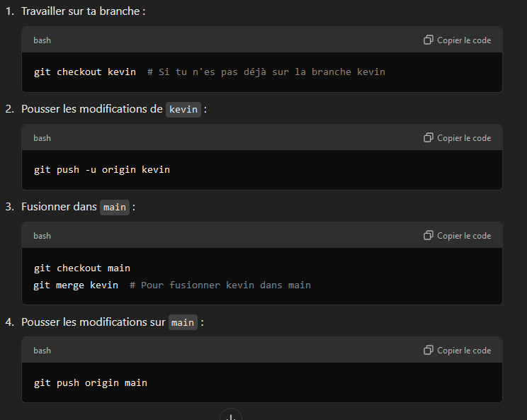
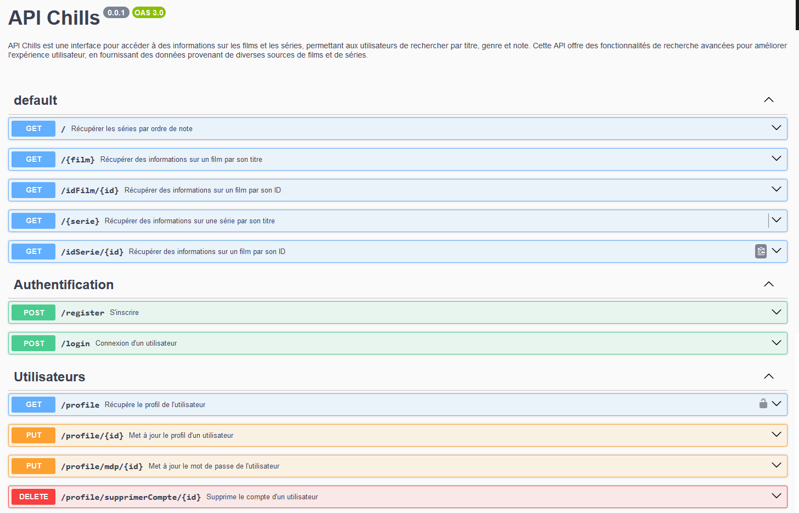

# CHILLS

Bienvenue dans le projet **CHILLS**, une application de vidéo à la demande (VOD) axée sur les films d'honneur. 

## Description

CHILLS est une plateforme conçue pour offrir une expérience immersive et engageante autour de films honorifiques. L'application est développée avec une architecture **RESTful API**, ce qui permet une communication fluide entre le client et le serveur. 

## Technologies utilisées

- **Front-end**: Vue.js 3
- **Back-end**: Express.js
- **Gestion de projet**: JIRA
- **Prototypage et design**: Figma
- **Environnement de développement**: VSCode
- **Bibliothèques**: Diverses bibliothèques seront intégrées selon les besoins

## Collaborateurs

- tOCHSka
- Cecile
- Denis
- MoH

## Installation

Instructions pour installer et exécuter l'application localement.

1. Clonez le dépôt :
   ```bash
   git clone https://github.com/navalnorth/back-chillz.git

2. Accédez au répertoire du projet :
    ```bash
    cd back-chillz

3. Installez les dépendances :
    ```bash
    npm install

4. Démarrez le serveur :
    ```bash 
    npm run serve
    
## Contribuer

Ce projet est uniquement modifiable par les membres de l'équipe. Aucune contribution externe n'est acceptée pour le moment.





## Swagger 

